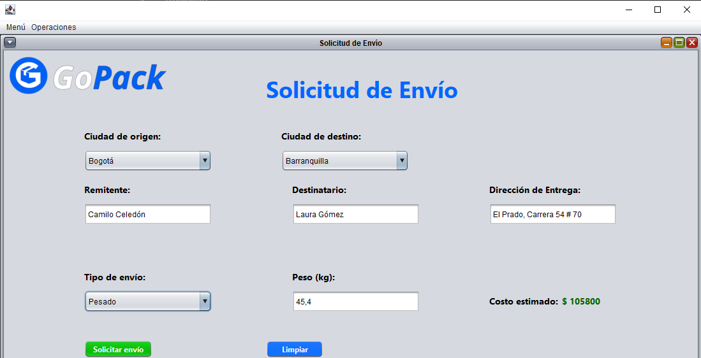
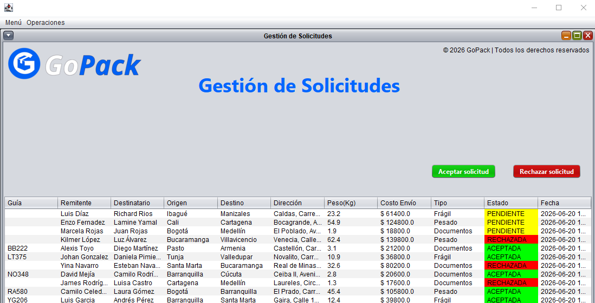

# GoPack

## Descripción

GoPack es un software de escritorio desarrollado en Java como proyecto académico.  
El sistema permite la gestión de paquetes y envíos, facilitando el registro, control y seguimiento de entregas dentro de una plataforma organizada y estructurada.

El proyecto fue diseñado aplicando principios de Programación Orientada a Objetos (POO), arquitectura (MVC) y conexión a base de datos MySQL para la persistencia de la información.

## Capturas

### Solicitud de envío

### Gestión de solicitudes

## Tecnologías

- Java (Swing / Desktop Application)
- MySQL
- JDBC (conexión a base de datos)

## Características

- Registro y gestión de paquetes
- Control de envíos y estados de entrega
- Consulta de información de paquetes
- Interfaz de escritorio intuitiva
- Conexión a base de datos MySQL
- Organización del sistema bajo arquitectura MVC

## Aprendizajes

Durante el desarrollo de este proyecto fortalecí mis conocimientos en:

- Desarrollo de aplicaciones de escritorio en Java
- Aplicación de Programación Orientada a Objetos (POO)
- Implementación de arquitectura MVC
- Conexión y gestión de bases de datos MySQL
- Uso de JDBC para comunicación con la base de datos
- Trabajo en equipo y control de versiones con Git y GitHub
- Organización y estructuración de proyectos de software

## Equipo de desarrollo

Proyecto desarrollado en colaboración por:

- Camilo Celedón
- Camilo Rodríguez
